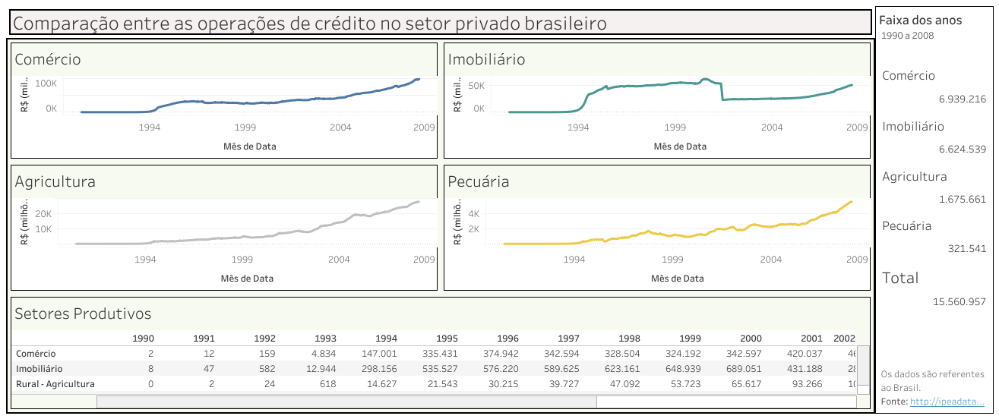

# Trabalho de Economia 2021 
Nesse trabalho criamos um painel de BI com o objetivo de comparar as operações de crédito em alguns setores produtivos do setor privado brasileiro de 1990 a 2008. A ferramenta usada para criar o dashboard foi o Tableau, e os dados usados no trabalho podem ser encontrados no portal do <a href="http://ipeadata.gov.br/Default.aspx">IPEA</a>.
 
O dashboard pode ser encontrado nesse <a href="https://public.tableau.com/views/Trabalho-Economia/Painel1?:language=pt&:display_count=y&publish=yes&:origin=viz_share_link">link</a> e abaixo temos uma imagem de como ficou o painel.
 

<b>Equipe:</b> 
<ul>
  <li>André Vinícius</li>
  <li>Emilly Lacerda</li>
  <li>Fernanda Leal</li>
</ul>
